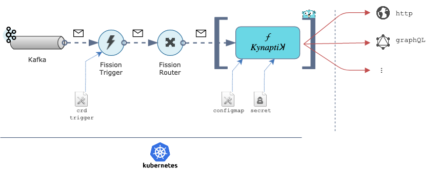

# Кynaptiꓘ


[](https://app.codacy.com/app/ccamel/kynaptik?utm_source=github.com&utm_medium=referral&utm_content=ccamel/kynaptik&utm_campaign=Badge_Grade_Dashboard)
[](https://circleci.com/gh/ccamel/kynaptik/tree/master)
[](https://coveralls.io/github/ccamel/kynaptik?branch=master)
[](https://codeclimate.com/github/ccamel/kynaptik/maintainability)
[](https://sonarcloud.io/dashboard?id=ccamel_kynaptik)
[](https://sonarcloud.io/dashboard?id=ccamel_kynaptik)
[](https://sonarcloud.io/dashboard?id=ccamel_kynaptik)
[](https://stackshare.io/ccamel/kynaptik)
[](https://golang.org/)

> Serverless Function on [Kubernetes][kubernetes] (through [Fission][fission]) providing a generic and configurable mean to trigger _actions_ from incoming _events_.

## Purpose

`Kynaptiꓘ` is a function which specifies how a stimulus (i.e. incoming request, message) elicits a response (i.e. invocation of endpoint).

More broadly, it provides a platform with a versatile and generic Web Hook serving multiple purposes.

## Principles

`Kynaptiꓘ` is a function that deploys on [Fission][fission] [FaaS](https://en.wikipedia.org/wiki/Function_as_a_service), an amazing framework for serverless functions on [Kubernetes][kubernetes].

The following diagram depicts how the main components interact:



## Features

`Kynaptiꓘ` is a simple, lean function with a deliberately limited set of features. Development is driven by the [KISS](https://en.wikipedia.org/wiki/KISS_principle) principle:
"do one thing well".

-   Conditional actions: an action is executed only in case a message matches the defined condition. That condition is specified by an [expression](https://github.com/antonmedv/expr) evaluated
    at running time against an environment containing the incoming message.
-   Extensible configuration of actions with templating: URL, HTTP method, headers and body.

**Out of scope:**

-   No complex conditions, e.g. based on a state based on time ([CEP](https://en.wikipedia.org/wiki/Complex_event_processing))
-   No content enrichment: no way to access an external data source in order to augment a message with missing information.

The incoming messages are expected to be qualified enough for the processing.

-   Fire and forget behavior: the action (e.g. HTTP post) is done once, the result is not used (a log is emitted though)
-   No recovery policy: no retry if the action fails

## Configuration

### configmap

`Kynaptiꓘ` is configured by a k8s `ConfigMap` which defines the configuration for the function.

The `ConfigMap` _shall_ declares the key `function-spec.yml` under the key `data`, which contains the `yaml` configuration of the function.

For instance:

```yaml
apiVersion: v1
kind: ConfigMap
metadata:
  namespace: default
  name: kynaptik-http-configmap
data:
  function-spec.yml: |
    timeout: 10000

    preCondition: |
      data.foo == "bar"

    action: |
      uri: 'https://foo-bar'            
      method: GET
      headers:
        Content-Type: application/json
        X-Userid: |
          {{if eq .data.user.firstname "john"}}Rmlyc3Qgb3B0aW9u={{else}}U2Vjb25kIG9wdGlvbg=={{end}}
      body: |
        {
          "message": "Hello from {{.data.user.firstname}} {{.data.user.lastname}}"
        }
    postCondition: |
      response.StatusCode >= 200 and response.StatusCode < 300
```

The yaml configuration has the following structure:

-   `preCondition`: optional, specifies the condition (textual) to be satisfied for the function to be triggered. The condition is an expression 
    (text) compliant with the syntax of [antonmedv/expr](https://github.com/antonmedv/expr/blob/master/docs/Language-Definition.md) engine. `true` by default.

-   `action`: specifies the action to perform. The action specification is _templated_ using the [go template engine](https://golang.org/pkg/text/template/).
    See section below to have details about the evaluation environment.
    -   `uri`: mandatory, the URI of the endpoint to invoke. Shall resolve to a URI according to [rfc3986](https://www.ietf.org/rfc/rfc3986.txt).
        The scheme specifies the kind of action (see below) that will be performed: http, graphql...
    -   `timeout`: optional, specifies the timeout for waiting for data (in ms).
    -   `...`: other fields depending on the kind of action.

-   `postCondition`: optional, specifies the condition (textual) to be satisfied for the response of the call be considered successful.

-   `maxBodySize`: optional, defines the maximum acceptable size (in bytes) of the incoming request body. No limit by default.

-   `timeout`: optional, specifies the timeout for waiting for data (in ms). No timeout by default.

The condition (either `preCondition` or `postCondition`) is an expression (text) compliant with the syntax of 
[antonmedv/expr](https://github.com/antonmedv/expr/blob/master/docs/Language-Definition.md) engine.

### secrets

Along with a [ConfigMap](https://kubernetes.io/docs/tasks/configure-pod-container/configure-pod-configmap/),  `Kynaptiꓘ` supports 
[k8s secrets](https://kubernetes.io/docs/concepts/configuration/secret/) which allows to inject sensitive information (such as passwords)
in the function, and make them available in the execution context.

The `secret` _shall_ declares the key `function-secret.yml` under the field `data`, which contains all the `yaml` secrets of the function.

For instance:

```yaml
apiVersion: v1
kind: Secret
metadata:
  namespace: default
  name: kynaptik-http-secret
type: Opaque
data:
  function-secret.yml: |
    username: YWRtaW4=
    password: c+KCrGNy4oKsdA==
```

### environment variables

Fission supports access to environment variables through `PodSpecs`, which defines the 
specifications of many behaviors of functions in a declarative manner. A complete documentation can be found
[here](https://docs.fission.io/docs/spec/podspec/envvar/).

Within `Kynaptiꓘ`, environment variables can easily be retrieved using the template action `env` and providing
the name of the variable as argument:

```gotemplate
{{ env "FOO" }}
```

Variable expansion is also available as template action, as shown below:

```gotemplate
{{ "Hello $FOO" | expandenv }}
```

## Evaluation context

The _preCondition_, _postCondition_ expressions and the _action_ template are processed against a context.

The data tag available in the context is following:

| name       | description                                                                                                                 | scope                    |
| ---------- | --------------------------------------------------------------------------------------------------------------------------- | ------------------------ |
| `data`     | The incoming message (_body_ only), serialized into a map structure, with preservation of primary types (numbers, strings). | always                   |
| `config`   | The current configuration (as loaded from the ConfigMaps).                                                                  | always                   |
| `secret`   | The current secret (if provided).                                                                                           | always                   |
| `response` | The response returned by the invocation. Datatype depends on the action performed.                                          | only for _postCondition_ |

Some useful functions are also injected in the context covering a large set of operations: string, date, maths, encoding, environment...
The functions are mainly brought by the [Masterminds/sprig](https://github.com/Masterminds/sprig) project. The complete description of those 
functions can be found [here](http://masterminds.github.io/sprig/).

## Actions

Here's the currently supported actions:

| Action        | Description                                                                       | Documentation                                 |
| ------------- | --------------------------------------------------------------------------------- | --------------------------------------------- |
| **`http`**    | Provides HTTP actions for calling external HTTP(S) resources.                     | [view documentation](./doc/action-http.md)    |
| **`graphql`** | Provides [GraphQL][graphql] actions for calling external [GraphQL][graphql] APIs. | [view documentation](./doc/action-graphql.md) |

[kubernetes]: https://kubernetes.io/

[fission]: https://fission.io/

[graphql]: https://graphql.org/
